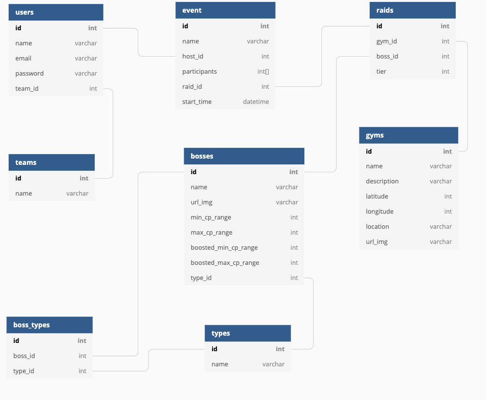

# Welcome to Raid-Hunters
# Introduction
This project will allow users to find raids in their area and create events that allow users to team up to defeat raid bosses!

# Features
- **User Auth**: Users will be able to sign-up/login to their account to view/create their events
- **Map View** : Users will be able to look at a map of all the gyms in their area.
- **Events**: Logged in users will be able to CRUD an event for raiding. Users will be able to join other user's events.
- **Comments**: Users will be able to comment on another user's event

## Technologies Used
**Backend**
- Python (Flask)
- React/Redux
- PostgreSQL
- SQLAlchemy Object Relational Mapper
- Werkzeug
- pyjwt. Generates javascript web tokens for user sessions
- Alembic. Engine for database relational migrations

## Frontend Routes
**Splash**
- / -> Homepage welcomes new users/ existing users with auth modal

**Authentication**
- /sign-up -> signs up for an account
- /login -> Existing users sign-in

**Map View**
- / Displays map with pins of all the gyms in area

**User profile**
- /user displays events user created and events user has joined

**Gyms**
- /gyms -> displays a list of all gyms
- /gyms/id/events -> display info about single gym including events

**Raids**
- /raids -> display all possible raids

**Events**
- /events displays all events in the area

## API Documentation
## Endpoints
**Auth**
- Login POST /api/auth/login
- Sign Up POST /api/auth/signup
- Log out GET /api/auth/logout

**Users**
- Get all users GET /api/users
- Create user event POST /api/users/<id>/create-event
- Edit user event PUT /api/users/<id>/events/id
- Delete user event DELETE /api/users/<id>/events/id

**Gyms**
- Get all gyms GET -> /api/gyms
- Get single gym GET -> /api/gyms/id

**Raids**
- Get all raids GET -> /api/raids

**Events**
- Get all events GET -> /api/events
- Get single event GET -> /api/events/id

## Wireframes

**HomePage**
https://wireframe.cc/IU6uOF
**Raids Page**
https://wireframe.cc/u3GzrE
**Gyms Page**
https://wireframe.cc/D3N1k0

## Database and Schema

